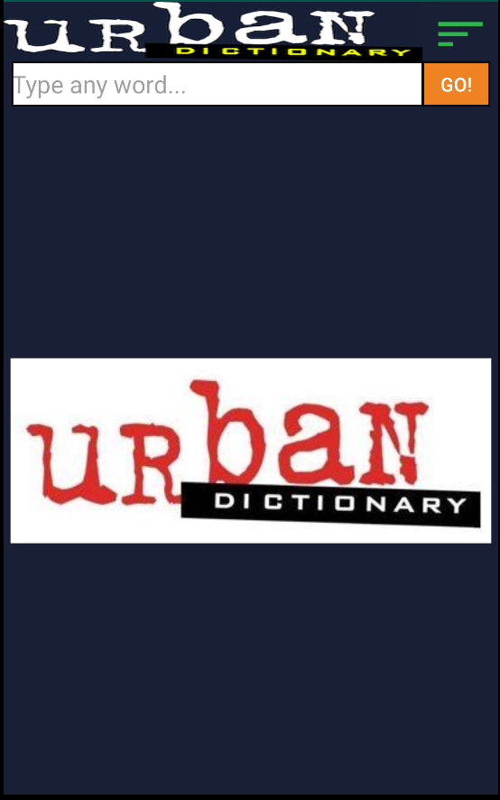
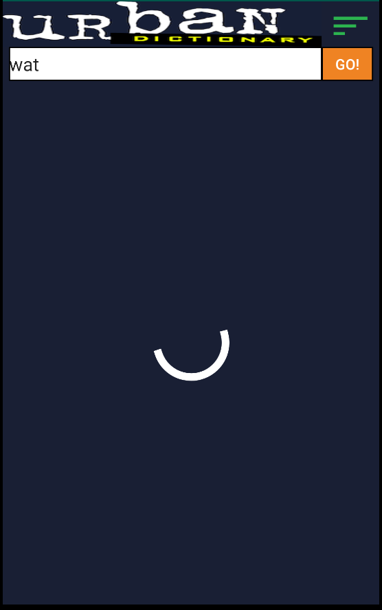
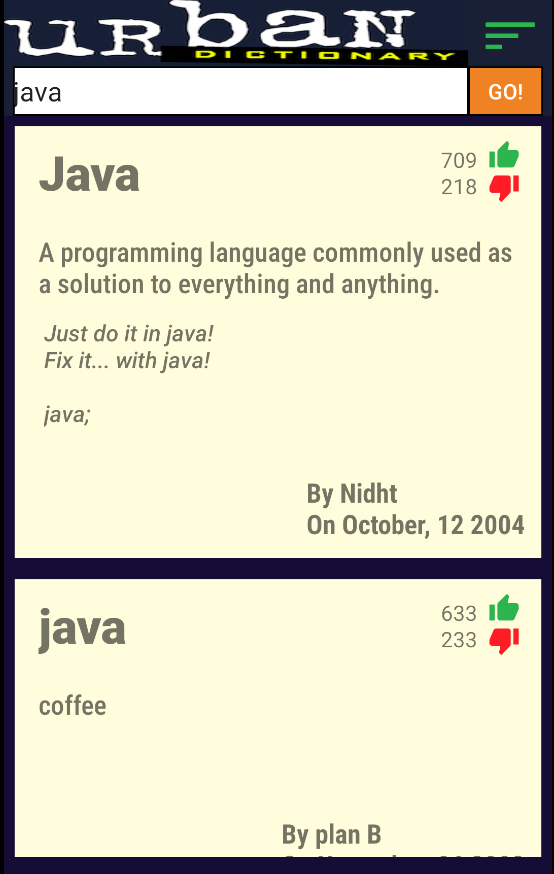
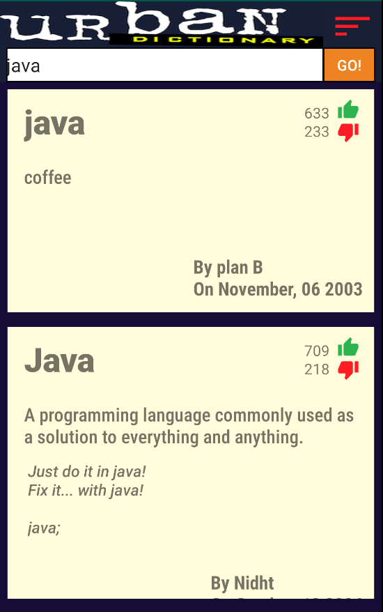
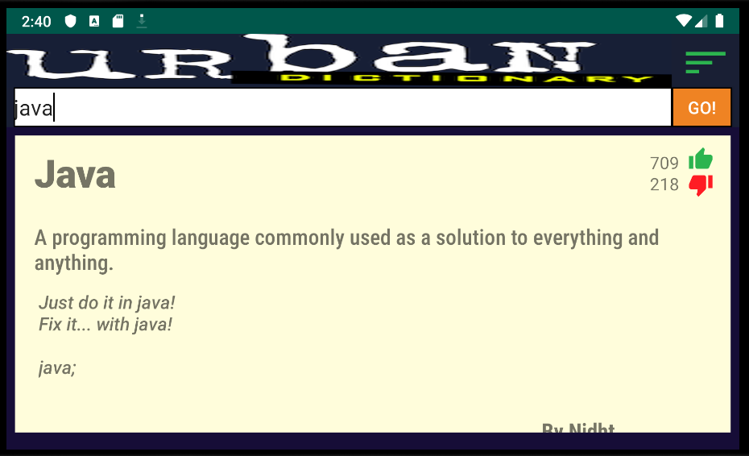

# Week4Daily4UrbanDictionary
This application aims to allow the user to query words from the UrbanDictionary API and fill a RecyclerView with the returned definitions for that word.

## MainActivity
This is the only activity for this application and holds an ImageView for the UrbanDictionary logo, a ToggleButton to allow the user to change how the results are sorts, an EditText to take input from the user, a Button to make the API call using the user input, a ProgressBar to indicate that the query is under way, and an ImageView to fill in the large empty space in the middle at the start of the activity. This activity registers to EventBus and subscribes to a message event that will be sent by the UrbanDictObserver containing the Urban Dictionary API response parsed into an UrbanDictionaryResponse Object. Once it received the message event, it takes out the UrbanDictResponse Object, retrieves the List of ListItems from it, then passes it to the UrbanDictAdapter which is passed to the RecyclerView to fill it with the information and show it to the user.

### UrbanDictAdapter
This is a simple adapter to manage the information stored within the RecyclerView. It handles the sorting when the ToggleButton is clicked and notifies the RecyclerView to change the order of the items.

### RetofitHelper
This helper uses two methods to build an instance of Retrofit, then create the service that will perform the API call.

### Url_Constants
This file holds the relevant constant strings needed to make the UrbanDictionary API call.

### ObservableUrbanDictService
This interface uses Retrofit annotations to build the API call that will get the user inputted term from the UrbanDictionary API. It adds the HEADERS and the PATH_API to the BASE_URL, as well as the QUERY_TERM; all of which were defined in the Url_Constants file. After making the API call, this service returns an ObservableObject containing an UrbanDictionaryResponse Object.

#### UrbanDictionaryResponse and ListItem
These two Java Objects are generated from the JSON response given by the UrbanDictionary API. The UrbanDictionaryResponse contains details of the API response and holds a List of ListItems which are the individual definitions for the term that was queried.

## UrbanDictObserver
This Observer looks out for an Observable containing an UrbanDictionaryResponse and processes it. In this case, it simply takes the UrbanDictionaryResponse and passes it to MainActivity using EventBus' post() method. 

#### UrbanDictResponseEvent
This is a simple wrapper class that holds the UrbanDictionaryResponse Object as it is sent from the UrbanDictObserver to MainActivity.

    
